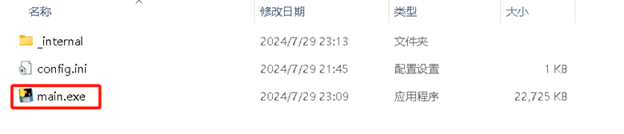
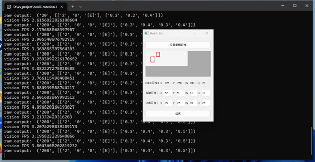

## A Wow rotation bot using hekili

这是一个用于《魔兽世界》的旋转机器人，它使用PIL、Pareq、和pyautogui等库分析、识别Hekili推荐的技能并自动化按键过程。

这是一个所谓的“像素机器人”：它只与像素工作，不修改游戏内存、插件或额外程序。

## Disclaimer :warning:

这个小项目仅用于教育目的，旨在探索使用AI图片识别技术创建一个功能性游戏机器人的可行性。

提供的软件永远不应在现实生活中的应用、游戏、服务器等中使用。

此软件没有被设计成以任何方式“不可检测”，也从未打算用于此类目的。所有随机性功能仅用于教育目的。

对于机器人的功能或结果，无法提供任何保证或保证，使用此软件可能产生的任何结果，您需承担全部责任。

## Guide :blue_book:

## 启动游戏
正常启动游戏，建议将游戏窗口最大化。
## 启动脚本程序
1. 点击main.exe文件

2. 点击设置截图区域
 
3. 选择Hekili推荐技能区域
 
4. 保证按键区域的红色框覆盖技能的快捷键，可通过手工设置坐标微调（技能冷却区域暂不使用）。技能快捷键目前只支持0-9，A-Z

 
5. 点击开始，稍等几秒种后后台会输出识别的按钮

6. 回到游戏，正常应该会自动按键

### Hints and issues
1. 性能问题
通过折叠按钮隐藏设置界面可以显著提高性能（40-60 FPS）。
 
2. 技能识别错的问题
技能偶尔识别错误，例如H、L，弹出任务框和PVP框，待改进。

3. 被检测问题
目前在国服WLK测试，打副本（5人本和团本）未被检测，打怪升级时可能会被检测。

4. 贡献
因本人刚开始接触和学习python和AI，程序难免有各种错误和不足，欢迎有兴趣的同学加入到改项目，共同学习并完善该项目。